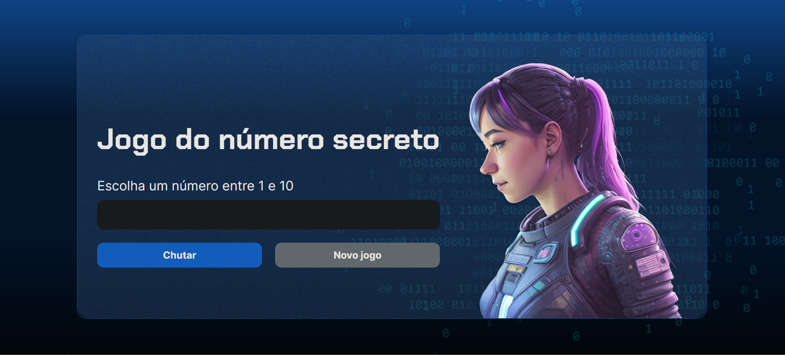

# Jogo do número secreto

> Formação Iniciante em Programação T6 ONE | ALURA - ORACLE

### O jogo:
- Projeto desenvolvidos nas aulas do curso Lógica de programação da Alura. [Clique aqui para acessar](https://jogo-blue-nine.vercel.app/)

### Tecnologias utilizadas:

   
   
   

